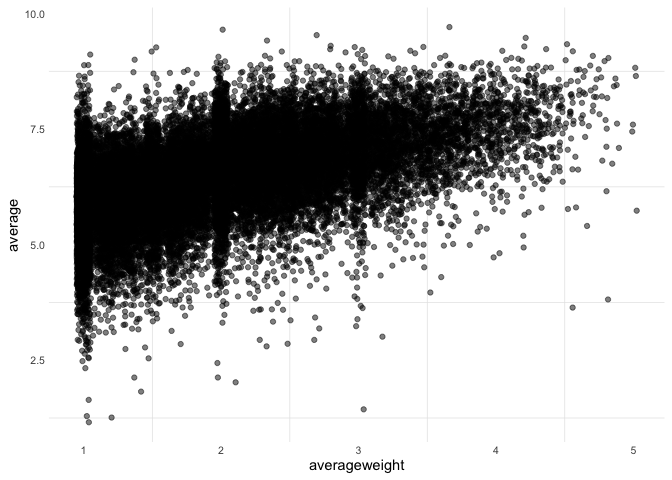

# Analysis

- [Data](#data)
- [Questions](#questions)
  - [What is the oldest game?](#what-is-the-oldest-game)
  - [What are the highest and lowest rated
    games?](#what-are-the-highest-and-lowest-rated-games)
  - [What is the relationship between **average** and
    **averageweight**?](#what-is-the-relationship-between-average-and-averageweight)

How have board games been rated by the BoardGameGeek (BGG) community
over time? This analysis looks at historical games and their ratings on
BGG.

# Data

The data comes from BoardGameGeek.com and contains 28020 games.

``` r
games |>
    sample_n(5)
```

    # A tibble: 5 × 26
      game_id name       yearpublished averageweight usersrated average bayesaverage
        <dbl> <chr>              <dbl>         <dbl>      <dbl>   <dbl>        <dbl>
    1    2788 First to …          1988          1            46    4.75         5.48
    2  338797 Beccato             2020          1            53    6.60         5.52
    3  368789 AFU: Arme…          2022          2.43        513    9.18         5.68
    4  211457 Sucesos A…          2016          1.5          41    6.73         5.52
    5   77423 The Lord …          2011          3.21      24003    7.66         7.40
    # ℹ 19 more variables: numweights <dbl>, minplayers <dbl>, maxplayers <dbl>,
    #   playingtime <dbl>, minplaytime <dbl>, maxplaytime <dbl>, minage <dbl>,
    #   description <chr>, thumbnail <chr>, image <chr>, categories <chr>,
    #   mechanics <chr>, publishers <chr>, designers <chr>, artists <chr>,
    #   families <chr>, mechanisms <chr>, components <chr>, themes <chr>

``` r
games |>
    filter(yearpublished > 1900) |>
    group_by(yearpublished) |>
    count() |>
    ggplot(aes(x=yearpublished, y=n))+
    geom_col()
```


The dataset contains games earlier than the 1900s, but the majority of
games in the dataset were published in the last 30 years.

BoardGameGeek aggregates ratings by thousands of users.

- **average**: average rating on a 0-10 scale by all users that have
  rated the game

- **usersrated**: the number of users that have rated the game

- **averageweight**: complexity of a game on a 1-5 scale, with 1 being
  simple and 5 being complex

- **bayesaverage**: also known as the Geek rating, a Bayesian average of
  the community’s average rating

# Questions

### What is the oldest game?

Find the oldest game in this dataset. Display its game_id, name,
yearpublished.

``` r
games |>
    slice_min(order_by = yearpublished, n = 1) |>
    select(name, game_id, yearpublished)
```

    # A tibble: 1 × 3
      name  game_id yearpublished
      <chr>   <dbl>         <dbl>
    1 Senet    2399         -3500

What is this game? Display its description.

``` r
games |>
    slice_min(order_by = yearpublished, n = 1) |>
    pull(description)
```

    [1] "Senet is an ancient Egyptian board game similar to backgammon.  Each player has 5 pawns which travel around a 3 by 10 board in an S shaped path.  Movement is dictated by the throw of 4 sticks (black on one side and white on the other) which can produce a 1,2,3,4, or 6, (5 is not possible) depending on how they land..  As in backgammon, the objective is to bear all of one's pawns off first.  A couple of interesting differences is that there are safe and trap spaces on the board.  Also, players may block each others' progress as in Parchisi.  Senet sets are usually constructed from various woods and are often quite beautiful.  Senet is one of the oldest boardgames but unfortunately it fell out of use for a few thousand years and no ancient rules set has been discovered.  Undoubtably another tragic loss resulting from the Library of Alexandria burning to the ground.  As a result scholars has made several educated guesses as to the rules.  The most popular versions are in the files section.\n\nIt may be a relative of Aseb and The Royal Game of Ur.\n\n"

### What are the highest and lowest rated games?

Find the top 5 highest/lowest rated games based on *bayesaverage*.
Display their game_id, name, yearpublished, bayesaverage, and
averageweight.

``` r
top_n = 5

top_games = 
    games |>
    slice_max(order_by = bayesaverage, n = top_n) 

worst_games = 
    games |>
    slice_min(order_by = bayesaverage, n = top_n) 

top_games |>
    bind_rows(worst_games) |>
    select(game_id, name, yearpublished, bayesaverage, averageweight)
```

    # A tibble: 10 × 5
       game_id name                         yearpublished bayesaverage averageweight
         <dbl> <chr>                                <dbl>        <dbl>         <dbl>
     1  224517 Brass: Birmingham                     2018         8.42          3.89
     2  161936 Pandemic Legacy: Season 1             2015         8.38          2.83
     3  174430 Gloomhaven                            2017         8.37          3.91
     4  342942 Ark Nova                              2021         8.33          3.75
     5  233078 Twilight Imperium: Fourth E…          2017         8.24          4.32
     6   11901 Tic-Tac-Toe                          -1300         3.64          1.28
     7    5432 Chutes and Ladders                    -200         3.66          1.03
     8    5048 Candy Land                            1949         3.84          1.12
     9    7316 Bingo                                 1530         4.05          1.04
    10    1406 Monopoly                              1935         4.29          1.62

### What is the relationship between **average** and **averageweight**?

Find the correlation between the BGG average rating (*average*) and
**averageweight**.

``` r
games |>
    select(average, averageweight) |>
    na.omit() |>
    cor()
```

                    average averageweight
    average       1.0000000     0.5283031
    averageweight 0.5283031     1.0000000

Display this relationship visually by making a scatter plot with
*averageweight* on the x axis and and average on the y axis. (It might
help to jitter the x axis slightly for visibility).

``` r
games |>
    ggplot(aes(x=averageweight,
               y=average))+
    geom_point(alpha = 0.5,
               position = position_jitter(width = 0.05)
    )
```


