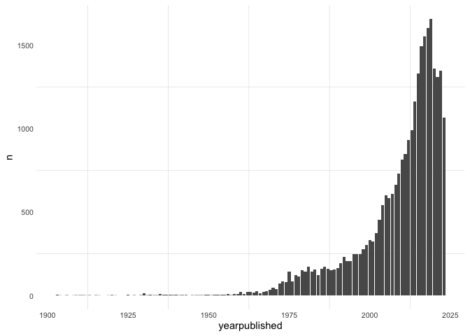

# Analysis

- [Data](#data)
- [Questions](#questions)
  - [What is the oldest game?](#what-is-the-oldest-game)
  - [What are the highest and lowest rated
    games?](#what-are-the-highest-and-lowest-rated-games)
  - [What is the relationship between **average** and
    **averageweight**?](#what-is-the-relationship-between-average-and-averageweight)

How have board games been rated by the BoardGameGeek (BGG) community
over time? This analysis looks at historical games and their ratings on
BGG.

# Data

The data comes from BoardGameGeek.com and contains 28020 games.

``` r
games |>
    sample_n(5)
```

    # A tibble: 5 × 26
      game_id name       yearpublished averageweight usersrated average bayesaverage
        <dbl> <chr>              <dbl>         <dbl>      <dbl>   <dbl>        <dbl>
    1  190530 Munchkin …          2010          2            30    6.16         5.51
    2  129287 War: Bata…          2012          2.29         72    5.72         5.50
    3  134626 Golden Ho…          2013          1.69        311    6.38         5.61
    4  332944 Sobek: 2 …          2021          1.93       2098    7.17         6.33
    5   14781 Drôles de…          2004          1.5         116    6.26         5.54
    # ℹ 19 more variables: numweights <dbl>, minplayers <dbl>, maxplayers <dbl>,
    #   playingtime <dbl>, minplaytime <dbl>, maxplaytime <dbl>, minage <dbl>,
    #   description <chr>, thumbnail <chr>, image <chr>, categories <chr>,
    #   mechanics <chr>, publishers <chr>, designers <chr>, artists <chr>,
    #   families <chr>, mechanisms <chr>, components <chr>, themes <chr>

``` r
games |>
    filter(yearpublished > 1900) |>
    group_by(yearpublished) |>
    count() |>
    ggplot(aes(x=yearpublished, y=n))+
    geom_col()
```



The dataset contains games earlier than the 1900s, but the majority of
games in the dataset were published in the last 30 years.

BoardGameGeek aggregates ratings by thousands of users.

- **average**: average rating on a 0-10 scale by all users that have
  rated the game

- **usersrated**: the number of users that have rated the game

- **averageweight**: complexity of a game on a 1-5 scale, with 1 being
  simple and 5 being complex

- **bayesaverage**: also known as the Geek rating, a Bayesian average of
  the community’s average rating

# Questions

### What is the oldest game?

Find the oldest game in this dataset. Display its game_id, name,
yearpublished.

What is this game? Display its description.

### What are the highest and lowest rated games?

Find the top 5 highest/lowest rated games based on *bayesaverage*.
Display their game_id, name, yearpublished, bayesaverage, and
averageweight.

### What is the relationship between **average** and **averageweight**?

Find the correlation between the BGG average rating (*average*) and
**averageweight**.

Display this relationship visually by making a scatter plot with
*averageweight* on the x axis and and average on the y axis. (It might
help to jitter the x axis slightly for visibility).
